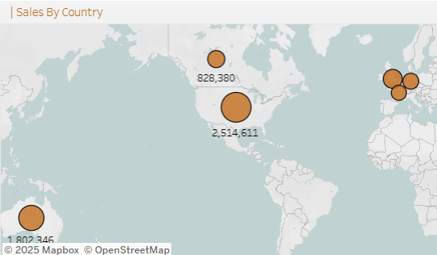
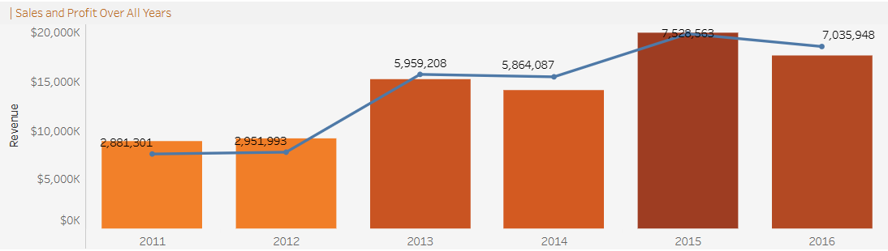
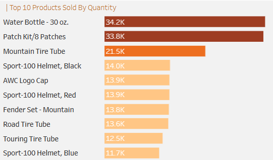
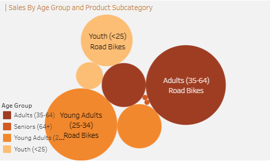

# Bike Sales Insights Dashboard

## Overview

This dashboard provides a comprehensive analysis of **bike sales performance across countries**, offering insights into revenue, profitability, customer segments, and product-level trends.  
The goal is to help businesses optimize product mix, improve market reach, and enhance profitability across regions.

The dataset includes multi-year transactional data from the bike retail business, covering **bikes, accessories, and clothing** across various global markets.

### 📁 Dashboard File  
Access the full analysis report here:  
[Bike Sales Analysis Report.pdf](./Analysis_report/Analysis%20Report.pdf)

---

## Tools & Techniques

This project leveraged:

- **📊 Charts and Visual Visualizations**  
- **📈 Trend and Time-Series Analysis**  
- **🧮 Category & Subcategory Profitability Breakdown**  
- **🌍 Geography-Level Performance Mapping**  
- **👥 Customer Segmentation Analysis**

---

## Dataset Description

The dataset includes:

- **🌍 Geographic Sales Data**
- **🚲 Product Categories (Bikes, Accessories, Clothing)**
- **💰 Revenue & Profit Metrics**
- **👥 Customer Demographics (Age, Gender)**
- **📦 Product-Level Order Quantities**
- **📅 Yearly & Monthly Time Trends**

This dataset allows multi-dimensional analysis of performance across markets, product lines, and time.

---

## Dashboard Construction

### 📊 Key Charts and Insights

---

#### **1. Sales by Country (Map / Bar Chart)**

- 🇺🇸 **The United States contributes the highest revenue and profit**  
- 🇨🇦 **Canada and 🇦🇺 Australia rank lowest** due to lower demand and inconsistent product performance  
- 📉 Underperforming regions include **Tasmania (Australia)** and **Ontario (Canada)**  
- 🌍 Market stability varies — some show cyclical trends while others show consistent growth  

---

#### **2. Profitability Trends (Line Chart / Bar Chart)**

- **2014 = lowest profit**, **2015 = highest profit**  
- Bikes deliver the strongest profit across all markets  
- Accessories & clothing show mixed margins:  
  - Strong performers: **helmets, jerseys, bike gear**  
  - Weak performers: **socks, caps**  

---

#### **3. Product-Level Performance (Bar Chart)**

- 🚲 **Road and Mountain bikes** dominate across all markets  
- High-order-quantity bikes (e.g., **Road-150**, **Mountain-200**) drive large revenue  
- Accessories like **water bottles**, **helmets**, and **jerseys** consistently rank high  
- Some products generate high revenue but low margins (e.g., **AWC Logo Cap**)  

---

#### **4. Customer Segmentation (Donut / Bar Chart)**

- 👥 **Adults aged 35–64** are the largest and highest-value segment  
- Gender insights:  
  - **Men dominate** accessories & clothing purchases  
  - **Women slightly lead** in bike purchases  
- Road & Mountain bikes outperform Touring across segments  

---

#### **5. Time Trends & Seasonality (Line Chart)**

- Seasonal patterns vary by country  
- Some consistent peaks (e.g., **December**)  
- Major profit jump from **2012 → 2013** due to introduction of accessories & clothing  

---

## Business Objective

To increase total revenue and profitability by:

- Improving product mix  
- Targeting high-value customer segments  
- Strengthening performance in underperforming regions  
- Enhancing pricing and inventory efficiency  
- Increasing customer engagement  

---

## Hypothesis

1. **Promoting high-demand, high-margin categories** (Road bikes, Helmets, Jerseys) will increase revenue and profit.  
2. **Introducing product bundles** (Bike + Accessory) will raise average order value (AOV).  
3. **Targeting adults aged 35–64** and optimizing campaigns for specific countries (e.g., Australia) will stabilize sales growth.  

---

## Opportunity Sizing

- 📈 **Increasing accessory attachment rate by 5%** can generate major incremental revenue due to high volume & strong margins  
- 🔄 Moving customers from low-margin items (caps, socks) to high-margin items (helmets, jerseys) increases total profit  
- 🌍 Improving underperforming regions by **5–7%** can yield a meaningful uplift due to the large size of markets like **US, UK, Germany**  
- 🎁 Bundling can raise AOV by **10–15%** depending on adoption levels  

---

## Actionable Insights

### **A. Sales & Market Growth**
- Focus on expanding in the **US and UK**  
- Strengthen strategies in weak markets like **Canada and Australia**  
- Improve demand generation in weaker-performing states  

---

### **B. Product Strategy**
- Prioritize **Road & Mountain bike** inventory  
- Expand **accessory bundles** to increase add-on purchases  
- Reevaluate pricing for low-margin items (caps, socks)  

---

### **C. Customer Segmentation**
- Target **35–64 age group** with performance-focused messaging  
- Segment campaigns:  
  - Men → accessories & clothing  
  - Women → bikes  
- Design demographic-driven campaigns for high engagement  

---

### **D. Profitability Optimization**
- Promote high-margin products  
- Improve sourcing & negotiate supplier terms  
- Encourage profitable basket compositions (bike + accessories)  

---

### **E. Operational Improvements**
- Standardize pricing in fluctuating regions  
- Improve demand forecasting  
- Strengthen supply chain for fast-moving items (e.g., bottles, helmets, jerseys)

---

## Conclusion

The bike business demonstrates strong growth potential across high-demand bike models, profitable accessories, and clear customer demographics.  
By refining product strategy, expanding in strong markets, and optimizing operational performance, the business can unlock substantial revenue and margin growth.

---

